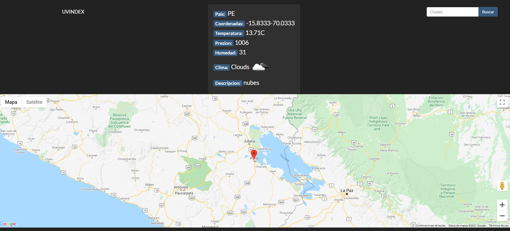
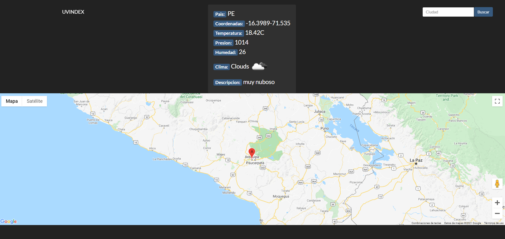

# UV INDEX
Obtención de niveles de radiación - índice UVB
Hay una barra de busqueda donde se coloca una ciudad en especifico y usando OpenWeatherAPI obtiene datos del clima del lugar. Y ademas muestra la ciudad en un mapa de Google
### Screenshots

